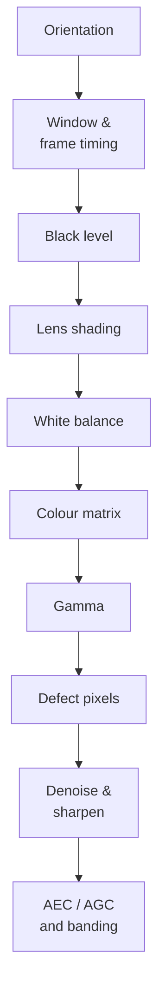

# OV5640 tuning playbook — bench procedures

Sep 23, 2026 · @niranjan

Companion document: the theory notes. Work through the steps in order — each one assumes the earlier ones are already correct.

## Ground rules

Every stage assumes the ones before it are already correct, so the order is not negotiable. A colour matrix fitted on a shaded, mis-balanced image is wrong everywhere.



### Freeze the loops first

Auto-anything makes measurements irreproducible. Before any capture:

| Register | Value | Effect |
| --- | --- | --- |
| 0x3503 | 0x03 | Manual exposure and manual gain |
| 0x3406 | 0x01 | Manual white balance |
| 0x3400-0x3405 | 0x0400 each | Unity AWB gains |
| 0x5001\[0\] | 0 | AWB off |

Then set exposure (0x3500-0x3502) and gain (0x350A/0x350B) explicitly and verify by reading them back. Also disable anything that would corrupt what you are measuring: for shading and colour work, turn off LENC (0x5000\[7\]), gamma (0x5000\[5\]), the colour matrix (0x5001\[1\]), DPC (0x5000\[2:1\]) and CIP sharpening.

### Get raw data out

The OV5640 can output 10-bit RAW Bayer instead of YUV. This is the single most valuable thing for tuning, because every calculation below wants linear per-channel values, and YUV output has already had the whole chain applied to it. Configure the format registers for RAW and de-Bayer offline in Python.

On ESP32-S3 the practical constraint is memory. A full 2592x1944 10-bit frame does not fit in PSRAM comfortably; capture a binned or windowed mode and note that shading maps measured in one mode do not transfer to another window without rescaling the grid.

### Equipment

| Purpose | What you need | Substitute |
| --- | --- | --- |
| Black level | Lens cap plus a closed box | Any light-tight enclosure |
| Lens shading | Uniform diffuse white field | Integrating sphere, or a lightbox with a heavy diffuser, or an evenly lit white wall shot defocused |
| White balance | Neutral grey card (18%) | Any spectrally flat grey |
| Colour matrix | X-Rite ColorChecker Classic (24 patch) | A printed chart will not do, its patch spectra are unknown |
| Illuminants | Tungsten, a CFL or LED panel, daylight | Note the CCT of each |
| Resolution and artefacts | Slanted edge or Siemens star chart | Printed at high quality on matte paper |

### Record everything

Keep the exposure, gain, temperature, illuminant and register dump beside each capture. Half the pain of sensor tuning is discovering later that you cannot tell which captures went with which settings.

## Step 1 - Orientation

This is the quick one, and you are right that it follows directly from how the module is mounted. The only trap is the Bayer phase.

1. Point the camera at a scene with obvious left/right and up/down asymmetry. A hand-written letter F works, which is why the datasheet uses one.
2. Set the sensor bits to match your mounting: 0x3821\[1\] for mirror, 0x3820\[1\] for flip.
3. Set the matching ISP bits in the same write: 0x3821\[2\] and 0x3820\[2\].
4. Check for colour errors on a **saturated, high-contrast edge** - a red object against white is ideal. If red and blue have swapped, or every edge has a magenta/green fringe, the Bayer phase is wrong.
5. If the phase is wrong, first try toggling only the ISP bit. If that does not fix it, shift X start (0x3800/0x3801) or the X offset (0x3811) by 1.

### Acceptance checks

- [ ] Scene orientation matches reality in both axes.
- [ ] A red object reads red, not blue, in the output.
- [ ] No colour fringing on edges that were clean before mirroring.
- [ ] The first output pixel's colour matches what your offline de-Bayer code assumes.

### Lock it before anything else

Orientation must be final before you tune shading, because the LENC grid is indexed in output coordinates. Flip the sensor later and your carefully measured corner gains land on the wrong corners. The same applies to the AEC zone weights.

## Step 2 - Window and frame timing

Fix the mode before tuning anything else, because t\_row is an input to the banding steps and the shading grid is indexed in output pixels.

### Choose the window

1. Set the ISP input window with 0x3800-0x3807. Use the full array unless you need the frame rate.
2. Set the output size in 0x3808-0x380B and the offsets in 0x3810-0x3813.
3. If scaling is on, keep the horizontal and vertical ratios equal, or straight lines come out at the wrong aspect.

### Measure t\_row rather than trusting the maths

You need t\_row accurately for banding and for timestamping. Do not compute it from a datasheet PCLK you have not verified.

**Method A, from the frame rate.** Capture N frames with a free-running pipeline, time them over 30 s, and divide:

```latex
t_{row} = \frac{1}{VTS \cdot fps}
```

**Method B, the banding sweep, which is the most useful.** Point the camera at a mains-powered lamp (not a DC LED), disable banding, and sweep exposure in single-row steps. Bands vanish at the exposure values that are exact multiples of 10 ms under 50 Hz. The first null gives you:

```latex
t_{row} = \frac{10\ \text{ms}}{E_{\text{first null}}}
```

This measures the real thing end to end, clock error included.

**Method C, a scope on VSYNC and HREF** if you have the pins broken out. Most accurate, least convenient.

### Worked check against the defaults

| Quantity | Register | Default | Value |
| --- | --- | --- | --- |
| HTS | 0x380C/0x380D | 0x0B1C | 2844 |
| VTS | 0x380E/0x380F | 0x07B0 | 1968 |
| PCLK | derived | - | 84 MHz |
| t\_row | derived | - | 33.9 us |
| B50 step | 0x3A08/0x3A09 | 0x0127 | 295 rows |
| B60 step | 0x3A0A/0x3A0B | 0x00F6 | 246 rows |

If your measured t\_row does not reproduce the B50 and B60 defaults for the mode you are running, the mode's banding registers need recomputing. That is normal: every mode with a different HTS needs its own values.

### Acceptance checks

- [ ] Output size and aspect ratio are what you asked for.
- [ ] Measured frame rate matches HTS x VTS x PCLK within 1%.
- [ ] t\_row confirmed by at least two of the three methods.
- [ ] The maximum exposure you need fits in VTS, or you have a plan to raise VTS.

## Step 3 - Black level

Your instinct is right, but note the division of labour: the **sensor** measures its own black level from the shielded rows every frame. The dark box is how you *verify* it and how you choose the target and the update policy.

### Capture

1. Cap the lens and put the module in a closed box. Check for light leaks by taking a long exposure and looking for gradients.
2. Capture RAW at several exposures, for example 1, 10, 50, 200 ms, and several gains, 1x, 4x, 16x.
3. If you can vary temperature, repeat cold and after 20 minutes of running. The sensor heats itself measurably.

### What to measure

For each capture compute, **per Bayer channel separately** (R, Gr, Gb, B - they differ):

- Mean. This is the black level as delivered.
- Standard deviation. This is your read noise floor in DN.
- The slope of mean versus exposure time, which is dark current in DN per second.

### Decide the settings

| Question | Register | How to decide |
| --- | --- | --- |
| Target level | 0x4009 | Default 0x10 at 10-bit. Raise it if the per-channel histograms are clipping at zero; lower it if you are wasting dynamic range |
| Continuous update | 0x4005\[1\] | On for anything that runs long enough to warm up. Off only if you see the level jumping under bright scenes |
| Recalibrate trigger | 0x4003\[7\], N in \[5:0\] | Fire after a mode change or a large gain change |
| Freeze | 0x4003\[6\] | Use while capturing tuning data so the level cannot drift mid-experiment |

### Acceptance checks

- [ ] Dark frame mean sits at the target, per channel, within a couple of DN.
- [ ] The four Bayer channels agree with each other. A split between Gr and Gb points at a readout path mismatch, not at BLC.
- [ ] The dark histogram is symmetric and not clipped at zero. A truncated left tail means the target is too low.
- [ ] Mean stays within a few DN across your full exposure and gain range, and after warm-up.
- [ ] With the lens back on, a scene black patch is neutral, not tinted. A colour cast in the shadows is the classic symptom of a per-channel black level error.

### Why to be fussy here

An error of a few DN is invisible in the dark frame itself and very visible after the rest of the chain. Lens shading multiplies it by up to 2x in the corners, white balance multiplies each channel differently, and gamma has its steepest slope exactly where the error lives. Shadow tint you cannot explain later usually traces back to this step.

## Step 4 - Lens shading

One correction first: the chart with lines on it measures **geometric distortion**, which this sensor does not correct. LENC needs a **flat field** - a featureless, uniformly lit white surface. Getting that field genuinely uniform is most of the work.

### Capture the flat field

1. Build the source. In order of quality: an integrating sphere, a lightbox with two layers of opal diffuser, or a white wall lit by two lamps at 45 degrees from both sides. For the wall, defocus fully and rotate the camera 180 degrees between two captures to average out any residual gradient in the illumination.
2. Expose so the centre green sits at 60-70% of full scale. Never let any channel clip - a clipped centre makes every gain too small.
3. Use the **lowest gain** and disable LENC, gamma, CCM, DPC and AWB.
4. Average 16-32 frames to kill temporal noise.
5. Subtract a dark frame taken at the same exposure and gain. This is why black level comes first.

### Compute the map

Split the averaged frame into the four Bayer planes. For each channel:

```latex
G_c(u,v) = \frac{F_c(u_0,v_0)}{F_c(u,v)}
```

1. Find the optical centre (u0, v0) as the brightest point of a smoothed green plane. It is often a few percent off the array centre, because the lens is not perfectly aligned to the die.
2. Fit a smooth model rather than using the raw measurement. A radial polynomial in r^2 works well: g(r) = 1 + a1 r^2 + a2 r^4 + a3 r^6. Fitting suppresses noise and dust shadows, which would otherwise be burned into the map as permanent artefacts.
3. Sample the fitted surface at the grid nodes: 6x6 for green, 5x5 for blue and red.
4. Quantise: 6-bit values for green at 0x5800-0x5823, nibbles for blue/red at 0x5824-0x583C with the offsets in 0x583D.

### Decide how far to correct

Full correction is rarely right. Corner gain multiplies corner noise by the same factor, so a 2.5x corner correction costs 8 dB of corner SNR.

| Use case | Target |
| --- | --- |
| Photography | Correct luminance to about 90-95% flat, colour shading fully |
| Machine vision | Correct colour shading fully, luminance only partially. Detectors tolerate a brightness gradient far better than they tolerate corner noise |

Colour shading is the part that must be fixed regardless, because it breaks white balance spatially: a scene that is neutral in the centre will be tinted in the corner.

Then set the gain adaptation: 0x583E and 0x583F bound the sensor gain range over which correction is scaled back, and 0x5840 sets the minimum strength at high gain.

### Acceptance checks

- [ ] Corrected flat field is uniform within a few percent across the frame.
- [ ] R/G and B/G ratios are flat across the frame. Plot them as a horizontal and a vertical profile - this is the colour shading test and the one that matters most.
- [ ] No visible seams at the grid block boundaries. Seams mean your fit is too coarse for the falloff.
- [ ] Corner noise at high gain is acceptable. Check this at gain 16x, not at 1x.
- [ ] Re-verify after any change to orientation, window or lens.

### The map is per lens, not per sensor

The shading profile belongs to the lens and its alignment to the die. Different module builds need different maps, and a module that has been re-focused has a different map. If you build more than a handful, you either accept a golden-sample map or you do a per-unit calibration on the line.

## Step 5 - White balance

Two separate jobs: find the correct gains per illuminant (a measurement), then make the automatic estimator find them by itself (a tuning).

### Part A - measure the ground truth

1. Light a grey card with one illuminant at a time. Use at least three: tungsten near 2800 K, a fluorescent or LED panel near 4000 K, and daylight or a D65 box near 6500 K.
2. Fill the frame with the card, slightly defocused, exposed to about 50% with no clipping.
3. LENC on, AWB off, gamma and CCM off. Capture RAW.
4. Average a central patch per Bayer channel and compute:

```latex
g_R = \frac{\bar G}{\bar R}, \qquad g_G = 1, \qquad g_B = \frac{\bar G}{\bar B}
```

5. Convert to register format: 0x0400 is 1.0x, so the register value is round(1024 x g). Write to 0x3400-0x3405 with 0x3406\[0\] = 1 and verify the card comes out neutral.

You now have a table of correct gains against colour temperature. Keep it - it is what you need for the colour matrix step, for a manual white balance mode, and as the reference for judging AWB.

| Illuminant | CCT | g\_R | g\_B | R gain / B gain |
| --- | --- | --- | --- | --- |
| Tungsten | \~2800 K |  |  |  |
| Fluorescent / LED | \~4000 K |  |  |  |
| Daylight | \~6500 K |  |  |  |

The last column is the useful one: it is monotonic in colour temperature and is your runtime CCT estimate.

### Part B - tune the automatic loop

Turn AWB back on (0x5001\[0\]) and work through these in order.

| Knob | Register | What to do |
| --- | --- | --- |
| Algorithm | 0x5183\[7\] | Start with simple (grey world) to get a baseline, then switch to advanced if colour casts on dominant-colour scenes bother you |
| Highlight exclusion | 0x5191 | Lower it until clipped pixels stop dragging the estimate. Symptom: white balance shifts when a bright window enters the frame |
| Shadow exclusion | 0x5192 | Raise it until dark noise stops contributing. Symptom: gains wander in dim scenes |
| Gain clamps | 0x5193-0x5195 | Set them just outside the range you measured in part A, so a pathological scene cannot drive the gains somewhere impossible |
| Stability | 0x5185 | Widen the hysteresis until gains stop reacting to someone walking past |
| Speed | 0x5181, 0x5182 | Fast enough to follow a walk from indoors to outdoors in a second or two, slow enough not to pump |

### Test scenes

The failures are all scene-dependent, so test deliberately:

- A single dominant colour filling the frame (grass, a red wall, a person's face). Grey world will neutralise it; advanced AWB should not.
- Mixed lighting, for example a window plus a tungsten lamp. There is no right answer, only a stable one.
- A large uniform white or grey wall, which starves the estimator of chroma variety.
- A sudden illuminant change, to watch convergence behaviour.

### Acceptance checks

- [ ] Grey card reads neutral under each of the three illuminants, within a few percent per channel.
- [ ] Gains converge in under about a second and then hold still.
- [ ] No oscillation or pumping on any test scene.
- [ ] A dominant-colour scene does not get neutralised into grey.
- [ ] Readback at 0x519F-0x51A4 lands close to the measured values from part A.

## Step 6 - Colour matrix

### Capture

1. Mount a ColorChecker Classic flat, filling about 60% of the frame, tilted slightly to avoid specular reflection.
2. Light it evenly with one illuminant. Check the evenness by photographing a white card in the same position first - a gradient across the chart biases the whole fit.
3. Set the AWB gains you measured for that illuminant, manually, and freeze them.
4. Expose so the white patch (patch 19) sits near 90% with no clipping in any channel.
5. LENC on, CCM off, gamma off, sharpening off. Capture RAW.
6. Repeat under each illuminant you care about.

### Solve

1. De-Bayer offline, or simply average each Bayer channel over each patch, which avoids demosaic error entirely. Take a central region of each patch to avoid edges.
2. Build M (3 x 24) from the measured linear RGB and T (3 x 24) from the reference values. The reference data for the chart is published per patch.
3. Solve the constrained least squares:

```latex
\min_{C} \lVert W(CM - T) \rVert_F^2 \quad \text{s.t.}\quad C\mathbf{1} = \mathbf{1}
```

W weights the patches. Weighting the six neutrals heavily is a common choice, since neutral errors are the most visible.

4. Better still, minimise delta-E in CIELAB rather than squared error in linear RGB, using scipy.optimize with the six free parameters (each row has two, the third being fixed by the row-sum constraint). The result is noticeably more pleasing for the same numerical error.
5. Check the noise gain of each row, sqrt(sum of squares of the row), before you accept the matrix. Anything above roughly 1.5 will show visible chroma noise at high gain.

### Write it

The registers hold the product of the YUV conversion and your CCM, not the CCM.

1. Compute CMX = RGB2YUV x C with your chosen YUV convention.
2. Split into magnitude and sign. Magnitudes go in 0x5381-0x5389, signs in 0x538A (CMX9) and 0x538B (CMX1-8).
3. Choose the fixed point format in 0x5380\[1\]: 1.7 if all coefficients fit below 2, 2.6 if any exceed it. Quantise accordingly and re-check the row sums after quantisation - rounding can break the white-preserving property and reintroduce a cast.
4. Enable with 0x5001\[1\].

### How many illuminants

You asked this directly, and the answer is: measure under three, ship one or two.

| Approach | When |
| --- | --- |
| One compromise matrix fitted over patches from all illuminants | Default choice. Machine vision, controlled lighting, or anything where a few delta-E of error is irrelevant |
| Two matrices switched in firmware at a colour temperature threshold | When you work both indoors under tungsten and outdoors |
| Two matrices blended by CCT | Best quality. Use the R gain / B gain ratio from 0x519F-0x51A4 as the CCT proxy and interpolate the coefficients linearly |

The OV5640 has one register bank, so anything beyond the first option lives in your firmware, not in the sensor.

### Acceptance checks

- [ ] Mean delta-E across 24 patches under 5, max under 10, for your chosen illuminant.
- [ ] Neutral patches stay neutral. A grey ramp with a hue shift means the row sums drifted in quantisation.
- [ ] Skin tones look right, if humans will see the output. They are the patches people notice.
- [ ] Chroma noise at high gain is acceptable, checked on a grey patch at gain 16x.
- [ ] Saturated colours are not clipping after the matrix. Negative off-diagonals can push a saturated red past full scale.

## Step 7 - Gamma

### Measure the curve you have

1. Photograph a grey-scale step wedge, or use the six neutral patches of the ColorChecker, with known reflectances.
2. Capture the same scene twice: RAW (linear reference) and processed output.
3. Plot output code against linear input. That is your current transfer function, end to end.

### Choose the curve you want

Start from a standard encoding rather than inventing one:

```latex
f(x) = \begin{cases} 12.92\,x & x \le 0.0031308 \\ 1.055\,x^{1/2.4} - 0.055 & \text{otherwise} \end{cases}
```

That is sRGB. Rec.709 is similar with a slightly different toe. Then adjust for taste and for noise:

| Goal | Change |
| --- | --- |
| Less visible shadow noise | Flatten the first two or three knots, extending the linear toe |
| More contrast | Steepen the mid-tones, which costs shadow and highlight separation |
| Preserve highlights | Flatten the last knots into a shoulder |
| Linear output for an algorithm | Set the knots to a straight line, or disable gamma with 0x5000\[5\] |

### Write it

1. Evaluate your curve at the hardware's input breakpoints and write the outputs to 0x5481-0x548F.
2. Set the final slope at 0x5490, with manual control enabled by 0x5480\[1\] if you want to fix it.
3. Enable with 0x5000\[5\].

Because the breakpoints are not published, derive them empirically: write a delta into one knot at a time and find which input range moves in the output. It takes fifteen captures and gives you the exact table for the rest of the project.

### Acceptance checks

- [ ] Knot values strictly increase. Any equality or inversion produces posterisation or tone reversal.
- [ ] A smooth gradient - a wall, a sky, a printed ramp - shows no contour bands. Bands mean a slope discontinuity at a knot.
- [ ] Grey wedge patches are evenly spaced in perceived lightness, not in code value.
- [ ] Shadow noise at gain 16x is acceptable. If not, flatten the toe rather than adding denoise.
- [ ] Neutrals stay neutral. Gamma is applied identically to all channels, so a tint appearing here means the black level or white balance is off.

### A note for vision pipelines

If the output feeds a detector rather than a display, think twice before applying a curve at all. Gamma makes the pixel values non-linear in radiance, which breaks photometric assumptions in direct-method VO, breaks simple exposure compensation between frames, and changes the effective noise model. A linear output with more bits is usually the better input, when the bandwidth allows it.

## Step 8 - Defect pixels

Only two enable bits are exposed, so this step is about deciding **whether** and **when**, and proving the filter is not eating real detail.

### Find out what you actually have

1. **Dark captures** with DPC off, at 1 ms and at your longest exposure, at low and high gain. Average 16 frames so temporal noise averages out and fixed defects remain.
2. Threshold each averaged dark frame against the local median. Count and map the outliers.
3. **Flat captures** at mid grey with DPC off, same treatment, to find dead and low-sensitivity pixels that only show under illumination.
4. Plot defect count against exposure time. The slope tells you how much of a problem you have in night mode specifically.

A typical part has a handful of hot pixels at short exposure and many more at 200 ms.

### Decide the policy

| Situation | White DPC (0x5000\[1\]) | Black DPC (0x5000\[2\]) |
| --- | --- | --- |
| Short exposure, low gain, detail-critical | Off or minimal | Off |
| General use | On | On |
| Long exposure or night mode | On, essential | On |
| Astro, point-target or star-like scenes | Careful - the filter cannot distinguish a real point source from a hot pixel | On |

That last row is the real trap. If your scene legitimately contains single-pixel bright points, white DPC will delete them. Anything involving distant lights at night falls into this category.

### Verify against both failure modes

**False negatives:** capture a dark frame with DPC on and count remaining outliers. Compare with the map from the first step. Anything left will appear as a fixed coloured speckle, and because it does not move between frames it is much more objectionable than random noise.

**False positives:** photograph a resolution chart and compare the finest resolvable line pairs with DPC on and off. Also photograph a scene with genuine specular highlights - a wire fence in sunlight, water sparkle, a string of LEDs at distance. If those points disappear, the filter is too aggressive for your application.

### Acceptance checks

- [ ] Defect map before and after, counted at your worst-case exposure and gain.
- [ ] No loss of resolution on the finest chart lines relative to DPC off.
- [ ] Genuine point sources survive.
- [ ] No residual fixed speckle visible on a flat dark scene at high gain.
- [ ] If you run a feature detector, the keypoint count and repeatability are no worse with DPC on.

## Step 9 - Denoise and sharpen (CIP)

This is the most subjective step and the one where a fixed setting is always wrong, because the right amount depends on gain.

### Build a gain ladder first

Everything here is tuned per gain level, so capture the same scene at gain 1x, 2x, 4x, 8x, 16x, 32x, adjusting exposure to keep brightness constant. Use one scene containing all four things you need to judge:

- A flat neutral area, to judge noise.
- Fine texture such as fabric or foliage, to judge detail loss.
- A slanted high-contrast edge, to judge sharpening overshoot.
- Fine repeating lines, to judge demosaic artefacts.

### Tune at the two ends, then let the ramp handle the middle

1. **At 1x gain**, set the low-gain endpoints. Denoise offset1 (0x5306) as low as you can tolerate, sharpen strength MT offset1 (0x5302) as high as you can before edges show halos, coring threshold TH offset1 (0x530B) just above the noise floor.
2. **At high gain**, set the high-gain endpoints: denoise offset2 (0x5307) stronger, sharpen MT offset2 (0x5303) weaker, coring TH offset2 (0x530C) higher.
3. **Set the ramp bounds** with the threshold registers (0x5301, 0x5304/0x5305, 0x5309/0x530A) so the transition covers the gain range you actually use.
4. Check the mid-gains. If 4x looks wrong while 1x and 16x look right, the ramp endpoints are fine but the thresholds are placed badly.

Use the manual overrides (0x5308\[6\] for sharpen, 0x5308\[4\] for denoise) while experimenting, then switch back to the gain-ramped mode and confirm the automatic values (readable at 0x530D-0x530F) land where you set them.

### The artefact checklist

| Artefact | Looks like | Cause |
| --- | --- | --- |
| Halo / overshoot | Bright rim on the light side of a dark edge | Sharpen strength too high |
| Noise amplification | Grain that gets worse, not better, after sharpening | Coring threshold too low |
| Plastic / waxy skin | Flat, smeared low-contrast areas | Denoise too strong |
| Detail loss | Fine texture becomes mush | Denoise threshold above the texture contrast |
| Zipper | Alternating light/dark pixels along near-horizontal edges | Demosaic, made obvious by sharpening |
| False colour | Coloured fringes on fine detail | Chroma aliasing, worsened by high sharpening |
| Maze / labyrinth | Wormy patterns in fine texture | Edge-directed demosaic picking the wrong direction |

### Acceptance checks

- [ ] No halos on the slanted edge at any gain.
- [ ] Texture survives at 1x and degrades gracefully, not abruptly, with gain.
- [ ] Noise is suppressed without the flat areas going plastic.
- [ ] No new artefacts appear at any point on the gain ladder.
- [ ] If a detector consumes the output: keypoint repeatability measured across the gain ladder, with and without enhancement. Mild or off usually wins.

## Step 10 - AEC, AGC and banding

Tune this last, because the loop's target depends on the tone curve you just set.

### A - compute the banding steps

Do this before anything else in this step, because the exposure ladder is built on it. For your mode's t\_row:

```latex
B_{50} = \frac{10\ \text{ms}}{t_{row}}, \qquad B_{60} = \frac{8.33\ \text{ms}}{t_{row}}
```

Write B50 to {0x3A08\[1:0\], 0x3A09} and B60 to {0x3A0A\[1:0\], 0x3A0B}. Set the maximum bands per frame in 0x3A0D (60 Hz) and 0x3A0E (50 Hz) to floor(VTS / B). Enable banding with 0x3A00\[5\], and auto-banding with 0x3A00\[4\] so the loop can drop below one band in bright light.

In Belgium the mains is 50 Hz, so force it: 0x3C01\[7\] = 1 for manual and 0x3C00\[2\] = 1 for 50 Hz. Auto-detection is only worth it for a product that travels.

Verify by pointing the camera at a mains-powered fluorescent or a cheap LED bulb and sweeping brightness. No horizontal bands should appear at any exposure the loop chooses.

### B - set the metering window and weights

1. Enable manual window control with 0x501D\[4\], then set the window with 0x5680-0x5687.
2. Set the 4x4 zone weights in 0x5688-0x568F. Each nibble is one zone, 0 to 15.

| Application | Weighting |
| --- | --- |
| General | Centre-weighted: high in the middle four zones, lower at the edges |
| Camera looking at the ground or a work surface | Weight the lower rows |
| Outdoor, sky in the top of the frame | Weight the top row to zero, or the sky will drive everything else dark |

### C - set the target and the bands

1. Set the stable enter band with 0x3A0F (high) and 0x3A10 (low). The midpoint of these is effectively your target brightness. Adjust it against a grey card: it should land at mid grey after gamma.
2. Set the leave band with 0x3A1B and 0x3A1E, **wider** than the enter band. The defaults make both bands identical, which means zero hysteresis and a loop that reacts to every small change. Widening this is the highest-value single edit in the whole step.
3. Set the fast zone with 0x3A11 (high) and 0x3A1F (low), where the loop jumps by halving or doubling.
4. Choose step mode in 0x3A05\[5\]: auto scales the step with the error, manual uses the fixed steps in 0x3A06 and 0x3A07. Auto is usually better behaved.

### D - set the ceilings

| Limit | Register | How to choose |
| --- | --- | --- |
| Maximum exposure, 50 Hz | 0x3A14/0x3A15 | The longest exposure your motion budget allows. For a moving platform, work it out from pixel blur: exposure x angular rate must stay under about one pixel |
| Maximum exposure, 60 Hz | 0x3A02/0x3A03 | Same |
| Minimum exposure | 0x3A01 | Leave at default unless very bright scenes clip |
| Gain ceiling | 0x3A18/0x3A19 | The gain at which noise becomes unacceptable for your use. Default is 62x, which is far more than most applications want |
| Night mode | 0x3A00\[2\] | On only if dropping frame rate in the dark is acceptable. For VIO or control loops it usually is not |

### Acceptance checks

- [ ] Grey card lands at the intended output level.
- [ ] No banding under mains lighting at any brightness.
- [ ] Loop converges in a second or two after a large light change, without overshoot or oscillation.
- [ ] No hunting when a person or a bright object crosses the frame.
- [ ] Exposure is preferred over gain: at moderate light levels, check that exposure is near its ceiling before gain starts rising.
- [ ] Frame rate stays constant unless night mode is deliberately enabled.

## Regression checks and what to log

### Keep the register set under version control

Treat the register list as source code, not as a magic array. For each entry keep the address, the value, which step produced it, and one line of why. Most OV5640 driver tables in the wild are copied from a vendor blob with no provenance, which makes every later change a guess.

### Log with every tuning capture

| Field | Why |
| --- | --- |
| Full register dump | The only way to reproduce a result |
| Exposure and gain, as read back | Not as written - confirm the sensor accepted them |
| Illuminant and its CCT | Colour results are meaningless without it |
| Module serial or build | Shading and defects are per unit |
| Sensor temperature or run time | Black level and defect counts move with it |
| Mode: window, HTS, VTS, binning | Shading maps and banding steps do not transfer between modes |

### A short regression suite

Run this after any change, however small. Each item maps to a step above.

- [ ] Dark frame: mean at target per channel, no clipping.
- [ ] Flat field: corrected uniformity, and flat R/G and B/G profiles.
- [ ] Grey card under three illuminants: neutral output.
- [ ] ColorChecker: mean and max delta-E within budget.
- [ ] Grey wedge: monotonic, evenly spaced, no contouring.
- [ ] Resolution chart: line pairs resolved, no halos.
- [ ] Mains lamp sweep: no banding at any brightness.
- [ ] Light-change response: converges quickly, no hunting.
- [ ] Gain ladder, 1x to 32x: no artefact appears abruptly at any step.

### Watch for cross-step regressions

These are the couplings that bite:

- Changing the window or binning invalidates the shading grid and the banding steps.
- Changing the gamma curve changes the AEC target, since the loop meters after the curve.
- Changing the colour matrix changes chroma noise, which changes the right denoise setting.
- Changing orientation invalidates the shading grid and the metering weights.
- Replacing the lens invalidates the shading grid entirely and may change the CCM slightly through the IR-cut filter.
