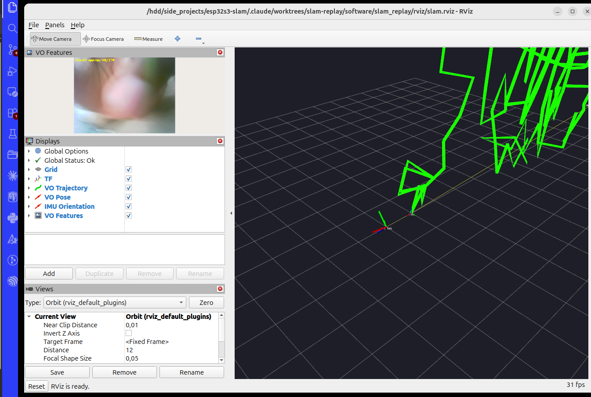

# `slam_replay` — replay the bag, visualise it, and run visual odometry

Tools to **replay** the ROS 2 bag recorded by `host_server` (camera + IMU from
the ESP32-S3 rig), **visualise** the streams in RViz, and run a lightweight
**monocular visual-odometry (VO)** pipeline whose trajectory you can watch build
up live in the same RViz window.



*Green polyline = recovered camera trajectory. The red/green triad at the origin
is the IMU orientation (`imu_link`). Top-left panel is the camera feed with the
tracked feature inliers drawn on it.*

Everything here uses only what ships with a ROS 2 desktop install
(`rviz2`, `image_transport`, `cv_bridge`, OpenCV) — **no external SLAM package
to install, nothing to `colcon build`.** The nodes are plain Python scripts and
the launch files are run by path.

---

## What's in the bag

`ros2 bag info software/bags/slam_20260704_172019`:

| Topic | Type | Count | Rate |
|-------|------|-------|------|
| `/camera/image_raw/compressed` | `sensor_msgs/CompressedImage` | 307 | ~2.3 fps (JPEG 640×480) |
| `/imu/data` | `sensor_msgs/Imu` | 12 737 | ~97 Hz (accel m/s², gyro rad/s) |

Duration ~132 s. Both streams share the ESP32's `esp_timer` clock, so they are
time-aligned in the bag.

---

## Prerequisites

- ROS 2 (developed on **Jazzy**) desktop install, sourced:

  ```bash
  source /opt/ros/jazzy/setup.bash
  ```

- Python `numpy`, `opencv` (`cv2`) and `cv_bridge` — all present in a standard
  ROS 2 desktop environment.

Run every command below from the **repository's `software/` directory** unless a
full path is given, so the default bag path resolves.

---

## Quick start

### 1. Just replay + look at the streams

```bash
source /opt/ros/jazzy/setup.bash
ros2 launch slam_replay/launch/replay.launch.py
```

This plays the bag, decompresses the JPEG into `/camera/image_raw`, and opens
RViz showing the camera image. Speed it up with `rate:=2.0`, or point at another
bag with `bag:=/path/to/other_bag`.

### 2. Replay **and** run visual odometry (the SLAM demo)

```bash
source /opt/ros/jazzy/setup.bash
ros2 launch slam_replay/launch/slam.launch.py
```

This starts everything in (1) plus the VO and IMU-orientation nodes and opens
RViz with the SLAM layout (matching the screenshot above). Watch the green
trajectory grow as the bag plays. When it finishes, the VO node logs how many
frames produced a usable pose update, e.g. `VO done: 153 pose updates over 302
frames`.

Useful arguments:

```bash
# slower, so large inter-frame motion is easier to track
ros2 launch slam_replay/launch/slam.launch.py rate:=0.5
```

To stop, `Ctrl-C` in the launching terminal (closes RViz and all nodes).

---

## What the RViz displays show (SLAM layout)

| Display | Topic | Meaning |
|---------|-------|---------|
| **VO Features** (image) | `/vo/features` | Camera frame with tracked inlier features drawn; overlay text shows inliers this frame and cumulative pose updates. |
| **VO Trajectory** (path) | `/vo/path` | The camera path so far (green line). |
| **VO Pose** (axes) | `/vo/pose` | Latest camera pose. |
| **IMU Orientation** (axes) | `/imu/orientation` | Device orientation from the complementary filter (fixed offset at x=1 so it doesn't sit on top of the path). |
| **TF** | — | Frames `camera_optical` (VO) and `imu_link` (IMU) relative to `map`. |
| **Grid** | — | 1 m reference grid on the `map` plane. |

Fixed frame is `map`, which is the **first camera frame's optical frame**
(Z forward, X right, Y down).

---

## How the visual odometry works

`mono_vo_node.py`, per frame:

1. Detect **ORB** features and match them (brute-force Hamming, cross-checked)
   against the previous frame.
2. Estimate the **essential matrix** with RANSAC and `recoverPose` to get the
   rotation `R` and (unit) translation `t` between the two views.
3. Compose into a running world pose and publish the path, pose, TF and the
   annotated debug image.

`imu_orientation_node.py` runs a **complementary filter** (gyro integration
corrected toward the accelerometer's gravity direction) to give orientation
only — it does **not** integrate position (consumer-grade accel diverges in
seconds).

### Honest limitations

- **Monocular scale is unobservable.** Each step is normalised to unit length,
  so the trajectory's *shape* is meaningful but its *metric size is arbitrary*.
  Fusing IMU acceleration for metric scale (true VIO) is future work.
- **The rig is uncalibrated.** The pinhole intrinsics default to an estimate
  from the image size and an assumed ~60° horizontal FOV
  (`fx=fy≈550, cx=320, cy=240`). Real calibration improves pose accuracy — see
  below.
- **~2.3 fps is low** for visual odometry. Large motion between frames sometimes
  breaks the essential-matrix estimate; those frames are skipped (roughly half
  of them in this bag). The inlier counter on the debug image shows when
  tracking is healthy.

### Using real calibration

Once you calibrate the camera (e.g. `ros2 run camera_calibration` with the
boards in `firmware/camera_calibration/`), pass the intrinsics to the VO node:

```bash
python3 slam_replay/mono_vo_node.py --ros-args -p use_sim_time:=true \
  -p fx:=<fx> -p fy:=<fy> -p cx:=<cx> -p cy:=<cy>
```

(and run the bag + republisher separately, or edit the values into the launch
file).

---

## Running the nodes standalone (without the launch file)

Each node is an ordinary ROS 2 Python node:

```bash
# terminal 1 — play the bag on the sim clock
ros2 bag play software/bags/slam_20260704_172019 --clock

# terminal 2 — visual odometry
python3 slam_replay/mono_vo_node.py --ros-args -p use_sim_time:=true

# terminal 3 — IMU orientation
python3 slam_replay/imu_orientation_node.py --ros-args -p use_sim_time:=true

# terminal 4 — RViz
rviz2 -d slam_replay/rviz/slam.rviz
```

---

## Layout

```
slam_replay/
  mono_vo_node.py          ORB monocular VO  -> /vo/path,/vo/pose,/vo/features,TF
  imu_orientation_node.py  complementary filter -> /imu/orientation, TF
  launch/
    replay.launch.py       bag play + decompress + RViz (streams only)
    slam.launch.py         the above + VO + IMU nodes + SLAM RViz layout
  rviz/
    replay.rviz            camera-image layout
    slam.rviz              trajectory + IMU + feature-image layout
  docs/
    rviz_slam.png          screenshot used in this README
```

---

## Troubleshooting

- **RViz shows nothing / "No transform from [camera_optical] to [map]".** The VO
  node only publishes once it has processed a frame; give the bag a second to
  start. If the bag has finished playing, TF ages out — replay it.
- **`package 'slam_replay' not found`.** The launch files are run *by path*
  (`ros2 launch slam_replay/launch/slam.launch.py`), not as an installed
  package. Run from the `software/` directory.
- **No image in RViz.** Confirm the republisher is up:
  `ros2 topic hz /camera/image_raw`. RViz can also show
  `/camera/image_raw/compressed` directly if you set the Image display's
  transport to `compressed`.
- **VO trajectory looks jumpy.** Expected at ~2.3 fps + unit scale; try
  `rate:=0.5` and see the *Limitations* section.
```
